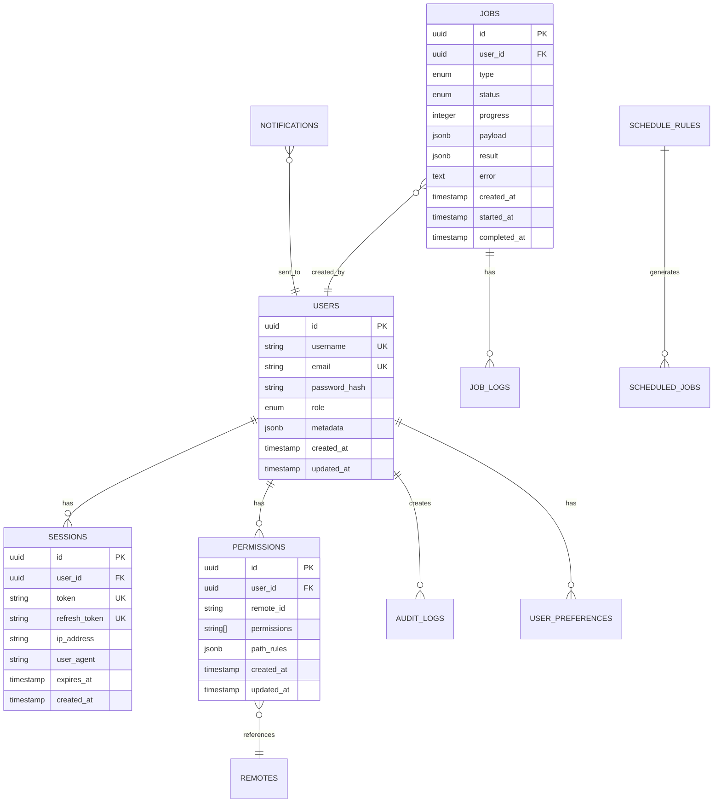

# Database Schema and Data Model
## RCMD (Rclone Commander)

**문서 버전**: 1.0
**작성일**: 2025-09-24
**데이터베이스**: PostgreSQL 16 + Redis 7

---

## 📋 목차
1. [데이터 모델 개요](#데이터-모델-개요)
2. [PostgreSQL 스키마](#postgresql-스키마)
3. [Redis 데이터 구조](#redis-데이터-구조)
4. [인덱스 및 최적화](#인덱스-및-최적화)
5. [데이터 무결성 및 제약사항](#데이터-무결성-및-제약사항)
6. [마이그레이션 전략](#마이그레이션-전략)

---

## 데이터 모델 개요

### ER 다이어그램


---

## PostgreSQL 스키마

### 1. Users Table
```sql
CREATE TABLE users (
    id UUID PRIMARY KEY DEFAULT gen_random_uuid(),
    username VARCHAR(50) UNIQUE NOT NULL,
    email VARCHAR(255) UNIQUE NOT NULL,
    password_hash VARCHAR(255) NOT NULL,
    role VARCHAR(20) NOT NULL DEFAULT 'user',
    is_active BOOLEAN DEFAULT true,
    is_verified BOOLEAN DEFAULT false,
    metadata JSONB DEFAULT '{}',
    created_at TIMESTAMP WITH TIME ZONE DEFAULT CURRENT_TIMESTAMP,
    updated_at TIMESTAMP WITH TIME ZONE DEFAULT CURRENT_TIMESTAMP,
    last_login_at TIMESTAMP WITH TIME ZONE,
    CONSTRAINT check_role CHECK (role IN ('admin', 'power_user', 'user')),
    CONSTRAINT check_email CHECK (email ~* '^[A-Za-z0-9._%+-]+@[A-Za-z0-9.-]+\.[A-Za-z]{2,}$')
);

-- 인덱스
CREATE INDEX idx_users_email ON users(email);
CREATE INDEX idx_users_username ON users(username);
CREATE INDEX idx_users_role ON users(role) WHERE is_active = true;
CREATE INDEX idx_users_metadata ON users USING GIN(metadata);

-- 트리거
CREATE TRIGGER update_users_updated_at
    BEFORE UPDATE ON users
    FOR EACH ROW
    EXECUTE FUNCTION update_updated_at_column();
```

### 2. Sessions Table
```sql
CREATE TABLE sessions (
    id UUID PRIMARY KEY DEFAULT gen_random_uuid(),
    user_id UUID NOT NULL REFERENCES users(id) ON DELETE CASCADE,
    token VARCHAR(500) UNIQUE NOT NULL,
    refresh_token VARCHAR(500) UNIQUE,
    ip_address INET,
    user_agent TEXT,
    device_info JSONB DEFAULT '{}',
    expires_at TIMESTAMP WITH TIME ZONE NOT NULL,
    refresh_expires_at TIMESTAMP WITH TIME ZONE,
    is_active BOOLEAN DEFAULT true,
    created_at TIMESTAMP WITH TIME ZONE DEFAULT CURRENT_TIMESTAMP,
    last_activity_at TIMESTAMP WITH TIME ZONE DEFAULT CURRENT_TIMESTAMP
);

-- 인덱스
CREATE INDEX idx_sessions_user_id ON sessions(user_id);
CREATE UNIQUE INDEX idx_sessions_token ON sessions(token) WHERE is_active = true;
CREATE INDEX idx_sessions_expires ON sessions(expires_at) WHERE is_active = true;

-- 자동 정리를 위한 파티셔닝
CREATE TABLE sessions_2025_q1 PARTITION OF sessions
    FOR VALUES FROM ('2025-01-01') TO ('2025-04-01');
```

### 3. Permissions Table
```sql
CREATE TABLE permissions (
    id UUID PRIMARY KEY DEFAULT gen_random_uuid(),
    user_id UUID NOT NULL REFERENCES users(id) ON DELETE CASCADE,
    remote_id VARCHAR(100) NOT NULL,
    permissions TEXT[] NOT NULL DEFAULT '{}',
    path_rules JSONB DEFAULT '[]',
    is_active BOOLEAN DEFAULT true,
    created_at TIMESTAMP WITH TIME ZONE DEFAULT CURRENT_TIMESTAMP,
    updated_at TIMESTAMP WITH TIME ZONE DEFAULT CURRENT_TIMESTAMP,
    created_by UUID REFERENCES users(id),
    CONSTRAINT unique_user_remote UNIQUE(user_id, remote_id),
    CONSTRAINT check_permissions CHECK (
        permissions <@ ARRAY['read', 'write', 'delete', 'admin']::text[]
    )
);

-- 인덱스
CREATE INDEX idx_permissions_user_remote ON permissions(user_id, remote_id);
CREATE INDEX idx_permissions_remote ON permissions(remote_id) WHERE is_active = true;
CREATE INDEX idx_permissions_path_rules ON permissions USING GIN(path_rules);

-- 예시 path_rules 구조
COMMENT ON COLUMN permissions.path_rules IS '
[
  {
    "path": "/public/*",
    "allow": ["read"],
    "deny": []
  },
  {
    "path": "/private/*",
    "allow": ["read", "write"],
    "deny": ["delete"]
  }
]';
```

### 4. Jobs Table
```sql
CREATE TABLE jobs (
    id UUID PRIMARY KEY DEFAULT gen_random_uuid(),
    user_id UUID NOT NULL REFERENCES users(id),
    type VARCHAR(50) NOT NULL,
    status VARCHAR(20) NOT NULL DEFAULT 'pending',
    priority INTEGER DEFAULT 5,
    progress INTEGER DEFAULT 0,
    payload JSONB NOT NULL,
    result JSONB,
    error TEXT,
    retry_count INTEGER DEFAULT 0,
    max_retries INTEGER DEFAULT 3,
    scheduled_for TIMESTAMP WITH TIME ZONE,
    created_at TIMESTAMP WITH TIME ZONE DEFAULT CURRENT_TIMESTAMP,
    started_at TIMESTAMP WITH TIME ZONE,
    completed_at TIMESTAMP WITH TIME ZONE,
    cancelled_at TIMESTAMP WITH TIME ZONE,
    CONSTRAINT check_type CHECK (type IN ('copy', 'move', 'delete', 'sync', 'backup')),
    CONSTRAINT check_status CHECK (status IN ('pending', 'queued', 'running', 'completed', 'failed', 'cancelled')),
    CONSTRAINT check_progress CHECK (progress >= 0 AND progress <= 100),
    CONSTRAINT check_priority CHECK (priority >= 1 AND priority <= 10)
);

-- 인덱스
CREATE INDEX idx_jobs_user_id ON jobs(user_id);
CREATE INDEX idx_jobs_status ON jobs(status) WHERE status IN ('pending', 'queued', 'running');
CREATE INDEX idx_jobs_type_status ON jobs(type, status);
CREATE INDEX idx_jobs_created_at ON jobs(created_at DESC);
CREATE INDEX idx_jobs_scheduled ON jobs(scheduled_for) WHERE scheduled_for IS NOT NULL;

-- 파티셔닝 (월별)
CREATE TABLE jobs_2025_01 PARTITION OF jobs
    FOR VALUES FROM ('2025-01-01') TO ('2025-02-01');
```

### 5. Job Logs Table
```sql
CREATE TABLE job_logs (
    id BIGSERIAL PRIMARY KEY,
    job_id UUID NOT NULL REFERENCES jobs(id) ON DELETE CASCADE,
    level VARCHAR(10) NOT NULL,
    message TEXT NOT NULL,
    details JSONB,
    created_at TIMESTAMP WITH TIME ZONE DEFAULT CURRENT_TIMESTAMP,
    CONSTRAINT check_level CHECK (level IN ('debug', 'info', 'warning', 'error', 'fatal'))
);

-- 인덱스
CREATE INDEX idx_job_logs_job_id ON job_logs(job_id);
CREATE INDEX idx_job_logs_level ON job_logs(level) WHERE level IN ('error', 'fatal');
CREATE INDEX idx_job_logs_created ON job_logs(created_at DESC);

-- 자동 정리 (30일 이상 된 로그 삭제)
CREATE INDEX idx_job_logs_cleanup ON job_logs(created_at)
    WHERE created_at < CURRENT_DATE - INTERVAL '30 days';
```

### 6. Audit Logs Table
```sql
CREATE TABLE audit_logs (
    id BIGSERIAL PRIMARY KEY,
    user_id UUID REFERENCES users(id),
    action VARCHAR(100) NOT NULL,
    resource_type VARCHAR(50),
    resource_id VARCHAR(255),
    details JSONB,
    ip_address INET,
    user_agent TEXT,
    result VARCHAR(20),
    created_at TIMESTAMP WITH TIME ZONE DEFAULT CURRENT_TIMESTAMP,
    CONSTRAINT check_result CHECK (result IN ('success', 'failure', 'error'))
) PARTITION BY RANGE (created_at);

-- 월별 파티션
CREATE TABLE audit_logs_2025_01 PARTITION OF audit_logs
    FOR VALUES FROM ('2025-01-01') TO ('2025-02-01');

-- 인덱스
CREATE INDEX idx_audit_logs_user_id ON audit_logs(user_id);
CREATE INDEX idx_audit_logs_action ON audit_logs(action);
CREATE INDEX idx_audit_logs_created ON audit_logs(created_at DESC);
CREATE INDEX idx_audit_logs_resource ON audit_logs(resource_type, resource_id);
```

### 7. Schedule Rules Table
```sql
CREATE TABLE schedule_rules (
    id UUID PRIMARY KEY DEFAULT gen_random_uuid(),
    user_id UUID NOT NULL REFERENCES users(id),
    name VARCHAR(255) NOT NULL,
    description TEXT,
    is_active BOOLEAN DEFAULT true,
    rule_type VARCHAR(20) NOT NULL,
    cron_expression VARCHAR(100),
    interval_seconds INTEGER,
    job_template JSONB NOT NULL,
    last_run_at TIMESTAMP WITH TIME ZONE,
    next_run_at TIMESTAMP WITH TIME ZONE,
    created_at TIMESTAMP WITH TIME ZONE DEFAULT CURRENT_TIMESTAMP,
    updated_at TIMESTAMP WITH TIME ZONE DEFAULT CURRENT_TIMESTAMP,
    CONSTRAINT check_rule_type CHECK (rule_type IN ('cron', 'interval', 'once')),
    CONSTRAINT check_cron_or_interval CHECK (
        (rule_type = 'cron' AND cron_expression IS NOT NULL) OR
        (rule_type = 'interval' AND interval_seconds IS NOT NULL) OR
        (rule_type = 'once')
    )
);

-- 인덱스
CREATE INDEX idx_schedule_rules_user ON schedule_rules(user_id) WHERE is_active = true;
CREATE INDEX idx_schedule_rules_next_run ON schedule_rules(next_run_at) WHERE is_active = true;
```

### 8. User Preferences Table
```sql
CREATE TABLE user_preferences (
    id UUID PRIMARY KEY DEFAULT gen_random_uuid(),
    user_id UUID UNIQUE NOT NULL REFERENCES users(id) ON DELETE CASCADE,
    theme VARCHAR(20) DEFAULT 'light',
    language VARCHAR(10) DEFAULT 'en',
    timezone VARCHAR(50) DEFAULT 'UTC',
    notifications JSONB DEFAULT '{}',
    ui_settings JSONB DEFAULT '{}',
    api_settings JSONB DEFAULT '{}',
    created_at TIMESTAMP WITH TIME ZONE DEFAULT CURRENT_TIMESTAMP,
    updated_at TIMESTAMP WITH TIME ZONE DEFAULT CURRENT_TIMESTAMP
);

-- 인덱스
CREATE UNIQUE INDEX idx_user_preferences_user ON user_preferences(user_id);
```

### 9. Notifications Table
```sql
CREATE TABLE notifications (
    id UUID PRIMARY KEY DEFAULT gen_random_uuid(),
    user_id UUID NOT NULL REFERENCES users(id),
    type VARCHAR(50) NOT NULL,
    title VARCHAR(255) NOT NULL,
    message TEXT,
    data JSONB,
    is_read BOOLEAN DEFAULT false,
    is_archived BOOLEAN DEFAULT false,
    priority VARCHAR(10) DEFAULT 'normal',
    expires_at TIMESTAMP WITH TIME ZONE,
    created_at TIMESTAMP WITH TIME ZONE DEFAULT CURRENT_TIMESTAMP,
    read_at TIMESTAMP WITH TIME ZONE,
    CONSTRAINT check_priority CHECK (priority IN ('low', 'normal', 'high', 'urgent'))
);

-- 인덱스
CREATE INDEX idx_notifications_user ON notifications(user_id, is_read, is_archived);
CREATE INDEX idx_notifications_created ON notifications(created_at DESC);
CREATE INDEX idx_notifications_expires ON notifications(expires_at) WHERE expires_at IS NOT NULL;
```

---

## Redis 데이터 구조

### 1. 세션 관리
```redis
# 사용자 세션
session:{session_id} = {
    "userId": "uuid",
    "username": "string",
    "role": "admin",
    "permissions": ["read", "write"],
    "createdAt": 1609459200,
    "expiresAt": 1609545600
}
TTL: 86400 (24시간)

# 활성 세션 목록
user:sessions:{user_id} = SET[session_id1, session_id2]
```

### 2. 캐시 관리
```redis
# 리모트 목록 캐시
cache:remotes:{user_id} = [
    {
        "id": "gdrive",
        "name": "Google Drive",
        "status": "online"
    }
]
TTL: 300 (5분)

# 파일 목록 캐시
cache:files:{remote_id}:{path_hash} = [
    {
        "name": "file.txt",
        "size": 1024,
        "modTime": "2025-09-24T10:00:00Z"
    }
]
TTL: 60 (1분)

# 권한 캐시
cache:permissions:{user_id}:{remote_id} = ["read", "write"]
TTL: 600 (10분)
```

### 3. 작업 큐
```redis
# 작업 큐 (Bull Queue)
bull:jobs:wait = LIST[job_id1, job_id2]
bull:jobs:active = LIST[job_id3]
bull:jobs:completed = SET[job_id4, job_id5]
bull:jobs:failed = SET[job_id6]

# 작업 상세 정보
bull:jobs:{job_id} = {
    "id": "job_uuid",
    "type": "copy",
    "status": "running",
    "progress": 45,
    "data": {...}
}
```

### 4. Rate Limiting
```redis
# API Rate Limiting (Sliding Window)
rate:api:{user_id}:{endpoint} = ZSET[
    timestamp1: request_id1,
    timestamp2: request_id2
]
TTL: 60 (1분 윈도우)

# 로그인 시도 제한
rate:login:{ip_address} = INCR
TTL: 300 (5분)
```

### 5. 실시간 통신
```redis
# SSE 클라이언트 추적
sse:clients = SET[client_id1, client_id2]
sse:client:{client_id} = {
    "userId": "uuid",
    "connectedAt": 1609459200,
    "channels": ["remotes", "jobs"]
}

# Pub/Sub 채널
pubsub:remotes = "remote status updates"
pubsub:jobs = "job progress updates"
pubsub:notifications = "user notifications"
```

### 6. 분산 잠금
```redis
# 리소스 잠금 (Redlock)
lock:remote:{remote_id} = "lock_value"
TTL: 30 (30초)

lock:job:{job_id} = "worker_id"
TTL: 300 (5분)
```

### 7. 통계 및 메트릭
```redis
# 카운터
stats:api:calls:{date} = INCR
stats:jobs:completed:{date} = INCR
stats:errors:{date}:{error_type} = INCR

# 시계열 데이터
timeseries:api:response_time = TS.ADD(timestamp, value)
timeseries:jobs:queue_size = TS.ADD(timestamp, value)
```

---

## 인덱스 및 최적화

### PostgreSQL 인덱스 전략

#### 1. 복합 인덱스
```sql
-- 자주 함께 조회되는 컬럼
CREATE INDEX idx_jobs_user_status_created
    ON jobs(user_id, status, created_at DESC)
    WHERE status IN ('pending', 'running');

CREATE INDEX idx_permissions_user_remote_active
    ON permissions(user_id, remote_id)
    WHERE is_active = true;
```

#### 2. 부분 인덱스
```sql
-- 활성 사용자만 인덱싱
CREATE INDEX idx_users_active
    ON users(username)
    WHERE is_active = true;

-- 최근 작업만 인덱싱
CREATE INDEX idx_jobs_recent
    ON jobs(created_at DESC)
    WHERE created_at > CURRENT_DATE - INTERVAL '7 days';
```

#### 3. 표현식 인덱스
```sql
-- 대소문자 구분 없는 검색
CREATE INDEX idx_users_username_lower
    ON users(LOWER(username));

-- JSONB 필드 인덱싱
CREATE INDEX idx_permissions_path_rules_paths
    ON permissions USING GIN((path_rules->'paths'));
```

### 쿼리 최적화 예시

#### 1. 효율적인 페이지네이션
```sql
-- Keyset Pagination (효율적)
SELECT * FROM jobs
WHERE user_id = $1
  AND (created_at, id) < ($2, $3)
ORDER BY created_at DESC, id DESC
LIMIT 20;

-- EXPLAIN ANALYZE 결과
-- Index Scan using idx_jobs_user_status_created
-- Planning Time: 0.2 ms
-- Execution Time: 0.5 ms
```

#### 2. JSONB 쿼리 최적화
```sql
-- 효율적인 JSONB 쿼리
SELECT * FROM permissions
WHERE user_id = $1
  AND path_rules @> '[{"path": "/documents/*"}]';

-- GIN 인덱스 활용
CREATE INDEX idx_permissions_paths
    ON permissions USING GIN(path_rules jsonb_path_ops);
```

---

## 데이터 무결성 및 제약사항

### 1. Foreign Key 제약
```sql
-- Cascade 삭제
ALTER TABLE sessions
    ADD CONSTRAINT fk_sessions_user
    FOREIGN KEY (user_id)
    REFERENCES users(id)
    ON DELETE CASCADE;

-- Restrict 삭제
ALTER TABLE audit_logs
    ADD CONSTRAINT fk_audit_logs_user
    FOREIGN KEY (user_id)
    REFERENCES users(id)
    ON DELETE RESTRICT;
```

### 2. Check 제약
```sql
-- 이메일 형식 검증
ALTER TABLE users
    ADD CONSTRAINT check_email_format
    CHECK (email ~* '^[A-Za-z0-9._%+-]+@[A-Za-z0-9.-]+\.[A-Za-z]{2,}$');

-- 날짜 논리 검증
ALTER TABLE jobs
    ADD CONSTRAINT check_job_dates
    CHECK (
        (started_at IS NULL OR started_at >= created_at) AND
        (completed_at IS NULL OR completed_at >= started_at)
    );
```

### 3. Unique 제약
```sql
-- 복합 유니크 제약
ALTER TABLE permissions
    ADD CONSTRAINT unique_user_remote_permission
    UNIQUE (user_id, remote_id);

-- 조건부 유니크 제약
CREATE UNIQUE INDEX unique_active_session_token
    ON sessions(token)
    WHERE is_active = true;
```

### 4. 트리거
```sql
-- updated_at 자동 업데이트
CREATE OR REPLACE FUNCTION update_updated_at_column()
RETURNS TRIGGER AS $$
BEGIN
    NEW.updated_at = CURRENT_TIMESTAMP;
    RETURN NEW;
END;
$$ language 'plpgsql';

CREATE TRIGGER update_users_updated_at
    BEFORE UPDATE ON users
    FOR EACH ROW
    EXECUTE FUNCTION update_updated_at_column();

-- 감사 로그 자동 생성
CREATE OR REPLACE FUNCTION create_audit_log()
RETURNS TRIGGER AS $$
BEGIN
    INSERT INTO audit_logs (user_id, action, resource_type, resource_id, details)
    VALUES (
        current_setting('app.current_user_id')::UUID,
        TG_OP,
        TG_TABLE_NAME,
        NEW.id::VARCHAR,
        to_jsonb(NEW)
    );
    RETURN NEW;
END;
$$ language 'plpgsql';
```

---

## 마이그레이션 전략

### 1. 마이그레이션 파일 구조
```
migrations/
├── 001_initial_schema.sql
├── 002_add_sessions_table.sql
├── 003_add_permissions_table.sql
├── 004_add_jobs_tables.sql
├── 005_add_audit_logs.sql
├── 006_add_indexes.sql
├── 007_add_partitioning.sql
└── rollback/
    ├── 007_rollback.sql
    ├── 006_rollback.sql
    └── ...
```

### 2. 마이그레이션 스크립트 예시
```sql
-- migrations/001_initial_schema.sql
BEGIN;

-- 마이그레이션 메타데이터
CREATE TABLE IF NOT EXISTS schema_migrations (
    version INTEGER PRIMARY KEY,
    name VARCHAR(255) NOT NULL,
    executed_at TIMESTAMP WITH TIME ZONE DEFAULT CURRENT_TIMESTAMP
);

-- Users 테이블 생성
CREATE TABLE users (
    id UUID PRIMARY KEY DEFAULT gen_random_uuid(),
    username VARCHAR(50) UNIQUE NOT NULL,
    -- ... 나머지 스키마
);

-- 마이그레이션 기록
INSERT INTO schema_migrations (version, name)
VALUES (1, 'initial_schema');

COMMIT;
```

### 3. Drizzle ORM 마이그레이션
```typescript
// drizzle.config.ts
import type { Config } from 'drizzle-kit';

export default {
  schema: './src/lib/server/database/schema.ts',
  out: './migrations',
  driver: 'pg',
  dbCredentials: {
    connectionString: process.env.DATABASE_URL!
  },
  verbose: true,
  strict: true
} satisfies Config;

// package.json scripts
{
  "db:generate": "drizzle-kit generate:pg",
  "db:push": "drizzle-kit push:pg",
  "db:migrate": "tsx src/lib/server/database/migrate.ts",
  "db:studio": "drizzle-kit studio"
}
```

### 4. 백업 및 복구
```bash
#!/bin/bash
# backup.sh

# 전체 백업
pg_dump -h localhost -U postgres -d rcmd \
    --format=custom \
    --file=backup_$(date +%Y%m%d_%H%M%S).dump

# 특정 테이블 백업
pg_dump -h localhost -U postgres -d rcmd \
    --table=users --table=permissions \
    --format=custom \
    --file=users_backup.dump

# 복구
pg_restore -h localhost -U postgres -d rcmd \
    --clean --if-exists \
    backup_20250924_100000.dump

# Redis 백업
redis-cli --rdb backup.rdb
```

---

## 성능 모니터링 쿼리

### 1. 느린 쿼리 찾기
```sql
-- 느린 쿼리 상위 10개
SELECT
    query,
    mean_exec_time,
    calls,
    total_exec_time,
    min_exec_time,
    max_exec_time
FROM pg_stat_statements
ORDER BY mean_exec_time DESC
LIMIT 10;
```

### 2. 인덱스 사용률
```sql
-- 사용되지 않는 인덱스
SELECT
    schemaname,
    tablename,
    indexname,
    idx_scan,
    idx_tup_read,
    idx_tup_fetch
FROM pg_stat_user_indexes
WHERE idx_scan = 0
ORDER BY tablename, indexname;
```

### 3. 테이블 크기 모니터링
```sql
-- 테이블별 크기
SELECT
    schemaname,
    tablename,
    pg_size_pretty(pg_total_relation_size(schemaname||'.'||tablename)) AS size,
    pg_size_pretty(pg_relation_size(schemaname||'.'||tablename)) AS table_size,
    pg_size_pretty(pg_total_relation_size(schemaname||'.'||tablename) -
                   pg_relation_size(schemaname||'.'||tablename)) AS indexes_size
FROM pg_tables
WHERE schemaname = 'public'
ORDER BY pg_total_relation_size(schemaname||'.'||tablename) DESC;
```

### 4. 연결 모니터링
```sql
-- 활성 연결 확인
SELECT
    pid,
    usename,
    application_name,
    client_addr,
    state,
    query_start,
    state_change,
    query
FROM pg_stat_activity
WHERE state != 'idle'
ORDER BY query_start DESC;
```

---

## 부록

### A. 데이터 타입 가이드
| PostgreSQL Type | TypeScript Type | 용도 |
|----------------|-----------------|------|
| UUID | string | 주키, 외래키 |
| VARCHAR | string | 텍스트 데이터 |
| TEXT | string | 긴 텍스트 |
| JSONB | object | 구조화된 데이터 |
| TIMESTAMP WITH TIME ZONE | Date | 시간 데이터 |
| INTEGER | number | 정수 |
| BOOLEAN | boolean | 불린 값 |
| INET | string | IP 주소 |
| TEXT[] | string[] | 배열 데이터 |

### B. 네이밍 컨벤션
```sql
-- 테이블: 복수형, snake_case
CREATE TABLE users (...);

-- 컬럼: snake_case
created_at TIMESTAMP;

-- 인덱스: idx_테이블명_컬럼명
CREATE INDEX idx_users_email;

-- 제약사항: 타입_테이블명_설명
CONSTRAINT check_users_email;
CONSTRAINT fk_sessions_user;
CONSTRAINT unique_user_remote;
```

### C. 파티셔닝 전략
```sql
-- 시간 기반 파티셔닝 (월별)
CREATE TABLE audit_logs_2025_01 PARTITION OF audit_logs
    FOR VALUES FROM ('2025-01-01') TO ('2025-02-01');

-- 자동 파티션 생성
CREATE OR REPLACE FUNCTION create_monthly_partition()
RETURNS void AS $$
DECLARE
    partition_name TEXT;
    start_date DATE;
    end_date DATE;
BEGIN
    start_date := DATE_TRUNC('month', CURRENT_DATE);
    end_date := start_date + INTERVAL '1 month';
    partition_name := 'audit_logs_' || TO_CHAR(start_date, 'YYYY_MM');

    EXECUTE format(
        'CREATE TABLE IF NOT EXISTS %I PARTITION OF audit_logs
         FOR VALUES FROM (%L) TO (%L)',
        partition_name, start_date, end_date
    );
END;
$$ LANGUAGE plpgsql;

-- 매월 실행
SELECT cron.schedule('create-partition', '0 0 1 * *', 'SELECT create_monthly_partition()');
```

---

**문서 완료**: 2025-09-24
**다음 단계**: 프로젝트 구현 시작